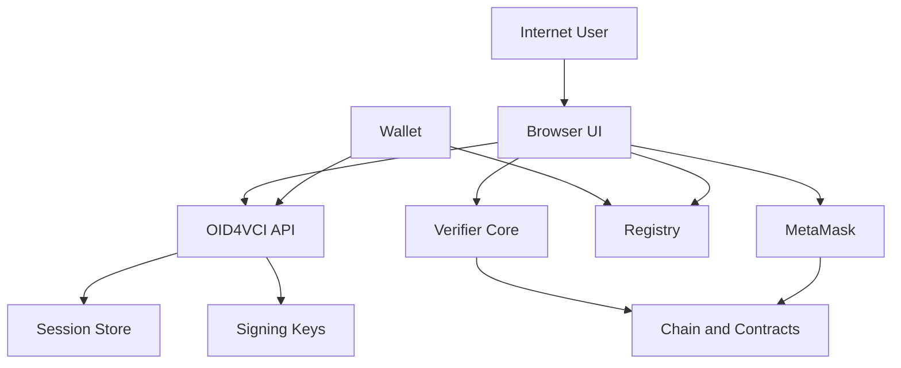

## Executive summary

The highest-risk themes in this repository are issuer-integrity compromise and public-service abuse. On a single public server, the most serious issues are that the browser build can expose `ISSUER_ED25519_PRIVATE_KEY` to any user, and the unauthenticated `POST /oid4vci/pickup-offer` flow can mint issuer-signed JWT credentials from attacker-supplied VC payloads. Secondary risks are public in-memory OID4VCI state abuse, denial of service against unauthenticated session endpoints, and operational integrity problems caused by dual signing paths and public-key drift.

## Scope and assumptions

- In-scope paths:
  - `src/ui/**`
  - `src/core/**`
  - `src/vc/**`
  - `src/verifier/**`
  - `src/revocation/**`
  - `src/oid4vci/**`
  - `src/contracts/abi/**`
  - `docs/issuer-architecture.md`
  - `docs/wallet-verification-import-flow.md`
- Out-of-scope:
  - `src/legacy/**`
  - tests as runtime behavior
  - planned OID4VP branch work not yet implemented
  - Notion publishing mechanics
- Explicit assumptions:
  - deployment model is one internet-reachable public server plus browser UI
  - all credential content, transcript data, signing keys, and owner-wallet authority are high-sensitivity assets
  - there is no application-layer authN/authZ in the current public server design
  - OID4VCI state is stored only in process memory
- Open questions that would materially change risk ranking:
  - whether `POST /oid4vci/pickup-offer` is intended to be operator-only behind another trust boundary
  - whether the public UI is served to untrusted internet users or only trusted university staff
  - whether the public server process has access controls around logs and environment variables

## System model

### Primary components

- React browser UI in `src/ui/App.tsx` handling issuance, verification, revocation, and wallet pickup
- issuance core in `src/core/issuance/issueBatch.ts`, `src/core/chain/deployBatchContract.ts`, and related hashing / Merkle modules
- JSON-LD VC assembly and Data Integrity signing in `src/vc/**`
- verifier pipeline in `src/verifier/index.ts` and related receipt / chain / proof modules
- revocation request derivation in `src/revocation/**`
- Express OID4VCI server in `src/oid4vci/server.ts`, `src/oid4vci/oid4vci.routes.ts`, and `src/oid4vci/oid4vci.controller.ts`
- OID4VCI state and JWT issuance in `src/oid4vci/oid4vci.service.ts`
- OID4VCI key management in `src/oid4vci/keys.ts`
- external trust dependencies:
  - registry DID/JWKS/contexts
  - blockchain RPC and deployed smart contracts
  - MetaMask / injected EIP-1193 provider

### Data flows and trust boundaries

- Internet user browser -> React UI
  - Data: student details, component contents, uploaded VCs, pasted VCs, recruiter/student verification inputs
  - Channel: HTTPS to static app / browser runtime
  - Security guarantees: browser-origin boundary only; no app auth; no server-side validation for browser-only flows
  - Validation: local UI validation only where implemented; evidence `src/ui/App.tsx`
- React UI -> OID4VCI Express API
  - Data: uploaded VC JSON, pickup-offer creation requests, wallet-pickup session creation
  - Channel: HTTP(S) fetch from browser to server
  - Security guarantees: none in app layer; no auth; no rate limiting visible; metadata and pickup endpoints are public
  - Validation: `postPickupOffer()` checks only that `vc` is an object and optional `subject_id` matches `vc.credentialSubject.id`; evidence `src/oid4vci/oid4vci.controller.ts#postPickupOffer`
- OID4VCI API -> in-memory OID4VCI session store
  - Data: pre-authorized codes, access tokens, nonces, uploaded VC snapshots
  - Channel: in-process `Map` usage
  - Security guarantees: process memory isolation only
  - Validation: TTL and one-time-use checks during token exchange; evidence `src/oid4vci/oid4vci.service.ts#createPreAuthCode`, `exchangeCodeForToken`
- Wallet -> OID4VCI API
  - Data: credential-offer resolution, metadata requests, token requests, bearer token credential requests
  - Channel: HTTP(S)
  - Security guarantees: random pre-authorized codes, TTL, bearer-token semantics
  - Validation: grant type checks, token lookup, bearer-token validation; evidence `src/oid4vci/oid4vci.controller.ts#postToken`, `postCredential`, `src/oid4vci/oid4vci.service.ts#exchangeCodeForToken`
- OID4VCI API -> signing key material
  - Data: `OID4VCI_PRIVATE_JWK`, inferred `kid`, public JWKS
  - Channel: environment variables and in-process key loading
  - Security guarantees: server-only process assumption
  - Validation: registry-backed `did:web` requires `OID4VCI_PRIVATE_JWK`; evidence `src/oid4vci/keys.ts#initKeys`
- Browser UI -> MetaMask / chain
  - Data: contract deployment, root anchoring, revocation transactions
  - Channel: injected EIP-1193 provider from browser to wallet, then blockchain RPC
  - Security guarantees: wallet account approval and chain-id checks in some flows
  - Validation: chain mismatch checks in revocation helper; evidence `src/core/chain/revocation.ts#revokeCredentialOnChain`
- Verifier core -> blockchain / contract
  - Data: Merkle root, contract address, revocation key
  - Channel: RPC read path
  - Security guarantees: depends on configured/public RPC integrity
  - Validation: receipt resolution and chain verification logic; evidence `src/verifier/index.ts`, `src/verifier/chainVerification.ts`
- Wallet / browser verifier -> registry
  - Data: issuer DID document, public JWK, contexts, schemas
  - Channel: HTTP(S)
  - Security guarantees: network transport and remote-host trust
  - Validation: wallet/verifier-specific proof and issuer checks; evidence `docs/wallet-verification-import-flow.md`, `src/oid4vci/keys.ts`

#### Diagram

## Assets and security objectives

| Asset | Why it matters | Security objective (C/I/A) |
| --- | --- | --- |
| Student diploma/transcript contents | Contains high-sensitivity educational and identity data | C, I |
| JSON-LD issuance signing key `ISSUER_ED25519_PRIVATE_KEY` | Lets an attacker forge downloadable university-issued credentials | C, I |
| OID4VCI signing key `OID4VCI_PRIVATE_JWK` | Lets an attacker mint wallet-importable JWT credentials | C, I |
| Uploaded VC snapshots in OID4VCI memory | Source material for later issuer-signed JWT credentials | C, I |
| Pre-authorized codes / access tokens / nonces | Gate access to wallet credential issuance sessions | C, I |
| Smart-contract owner wallet authority | Controls on-chain revocation and anchoring actions | I, A |
| Merkle roots, receipts, and contract addresses | Integrity-critical linkage between credentials and chain anchors | I |
| Public DID/JWKS alignment | Required for wallet trust in issuer signatures | I, A |
| Public OID4VCI API availability | Required for wallet import flow completion | A |
| Build artifacts served to browsers | Can leak injected env values or maliciously altered logic | C, I |

## Attacker model

### Capabilities

- Remote unauthenticated internet attacker who can reach the public browser UI and OID4VCI HTTP endpoints
- Attacker can submit arbitrary uploaded VC JSON to the pickup API
- Attacker can create many pickup sessions and token requests
- Attacker can inspect all browser-bundled code and env-derived client data
- Attacker can attempt phishing or browser compromise against operators using MetaMask
- Attacker can replay or race public offer URLs if they obtain them

### Non-capabilities

- Attacker is not assumed to compromise the blockchain network itself
- Attacker is not assumed to break modern cryptography directly
- Attacker is not assumed to control the registry host or TLS stack unless separately compromised
- Attacker is not assumed to read server environment variables directly without another weakness

## Entry points and attack surfaces

| Surface | How reached | Trust boundary | Notes | Evidence (repo path / symbol) |
| --- | --- | --- | --- | --- |
| Browser issue form | Public browser UI | Internet -> Browser UI | Accepts student IDs, DIDs, degree data, and component content | `src/ui/App.tsx` |
| Browser verify tab | Public browser UI | Internet -> Browser UI | Accepts pasted VC JSON and optional RPC URL | `src/ui/App.tsx` |
| Browser wallet pickup upload | Public browser UI | Internet -> Browser UI | Accepts uploaded VC JSON and creates pickup offers | `src/ui/App.tsx`, `src/ui/pickupVcFile.ts` |
| `POST /oid4vci/pickup-offer` | Public HTTP API | Browser -> OID4VCI API | Unauthenticated upload-to-signing pipeline entrypoint | `src/oid4vci/oid4vci.controller.ts#postPickupOffer` |
| `GET /oid4vci/credential-offer` | Wallet HTTP API | Wallet -> OID4VCI API | Returns pre-authorized credential offer by reference | `src/oid4vci/oid4vci.controller.ts#getCredentialOffer` |
| `POST /oid4vci/token` | Wallet HTTP API | Wallet -> OID4VCI API | Exchanges one-time code for bearer token | `src/oid4vci/oid4vci.controller.ts#postToken` |
| `POST /oid4vci/credential` | Wallet HTTP API | Wallet -> OID4VCI API | Returns issuer-signed JWT credential | `src/oid4vci/oid4vci.controller.ts#postCredential` |
| `/.well-known/openid-credential-issuer*` | Public metadata API | Wallet -> OID4VCI API | Discloses issuer metadata and draft split | `src/oid4vci/oid4vci.controller.ts#getIssuerMetadata`, `getIssuerMetadataDraft11` |
| MetaMask revocation/deployment actions | Browser wallet interaction | Browser UI -> MetaMask -> Chain | High-integrity action surface for contract changes | `src/core/chain/deployBatchContract.ts`, `src/core/chain/revocation.ts` |
| Server key loading | Server startup | Env -> OID4VCI API | Secrets handling and auto-generated demo key logging | `src/oid4vci/keys.ts#initKeys` |

## Top abuse paths

1. Attacker loads the public browser bundle, extracts `ISSUER_ED25519_PRIVATE_KEY`, forges JSON-LD credentials offline, and produces credentials that appear university-signed to any verifier trusting that key.
2. Attacker calls `POST /oid4vci/pickup-offer` with an arbitrary VC-like JSON object, obtains a valid pre-authorized offer, redeems it, and receives a server-signed JWT credential containing attacker-chosen claims under the university issuer DID.
3. Attacker creates large volumes of pickup offers or uploads oversized VC payloads, causing unbounded in-memory session growth and degrading or denying wallet issuance service.
4. Attacker intercepts or obtains a public offer URL before the intended holder redeems it, exchanges the pre-authorized code first, and receives the credential.
5. Attacker exploits operator browser compromise or phishing to trigger MetaMask contract deployment / revocation actions and corrupt on-chain integrity state.
6. Operator runs the public server without `OID4VCI_PRIVATE_JWK`, the server logs an auto-generated ES256 private JWK, and anyone with log access can later mint wallet credentials.
7. Misconfigured `BASE_URL` or multi-instance deployment causes codes to be minted on one instance and redeemed on another, leading to repeated issuance failures and availability loss for real users.

## Threat model table

| Threat ID | Threat source | Prerequisites | Threat action | Impact | Impacted assets | Existing controls (evidence) | Gaps | Recommended mitigations | Detection ideas | Likelihood | Impact severity | Priority |
| --- | --- | --- | --- | --- | --- | --- | --- | --- | --- | --- | --- | --- |
| TM-001 | Remote internet user | Public UI served with browser-injected env including private signing key | Extract `ISSUER_ED25519_PRIVATE_KEY` from client bundle or runtime and forge JSON-LD credentials | University credential integrity collapse for browser-issued VCs | JSON-LD signing key, issued credentials, issuer trust | README warning says browser env is bundled; UI signing path uses client env; evidence `README.md`, `docs/issuer-architecture.md`, `src/vc/**` | Warning is not a control; private signing in browser is fundamentally exposed | Move Data Integrity signing server-side, remove `ISSUER_ED25519_PRIVATE_KEY` from Vite allowlist, rotate current key after redesign | Alert on unusual verifier failures, key rotation events, issuance anomalies, signed credential duplicates | high | high | critical |
| TM-002 | Remote internet user | Public access to `POST /oid4vci/pickup-offer` and no auth gate | Upload attacker-chosen VC JSON, redeem the resulting offer, obtain issuer-signed JWT VC | Unauthorized credential minting under university issuer DID | OID4VCI signing key trust, issuer reputation, student/recruiter trust | Minimal body/object validation and subject-id consistency check; evidence `src/oid4vci/oid4vci.controller.ts#postPickupOffer`, `src/oid4vci/oid4vci.service.ts#createPickupOfferResponseFromVc`, `buildJwtVc` | No authN, no issuer-side policy check, no schema/claim allowlist, uploaded payload becomes signed credential content | Require operator or backend auth for offer creation, enforce strict VC schema and issuer-side claim policy, bind uploads to trusted issuance records only, log/audit issuance origin | Audit every pickup-offer creation with caller IP/session/operator, alert on unusual subjects/types/volume | high | high | critical |
| TM-003 | Remote internet user | Public unauthenticated OID4VCI pickup surfaces | Flood pickup-offer creation, token exchanges, and large uploads to exhaust memory or CPU | Wallet issuance unavailable or degraded | OID4VCI API availability, in-memory session store | TTL and one-time token checks exist; evidence `src/oid4vci/oid4vci.service.ts` | No auth, no rate limits, no upload size caps, in-memory state only | Add request size limits, rate limits, per-IP/session quotas, cleanup limits, and external durable store if scaling | Monitor request rate, memory usage, session counts, upload size distribution, 400/500 spikes | high | medium | high |
| TM-004 | Network attacker or unintended recipient of offer URL | Access to copied/shared `offerUri` before intended wallet redemption | Race the intended holder and redeem the pre-authorized code first | Unauthorized credential pickup or user denial of issuance | Pre-authorized codes, uploaded VC snapshots, wallet-issued credentials | UUID-based random codes, TTL, one-time use; evidence `src/oid4vci/oid4vci.service.ts#createPreAuthCode`, `exchangeCodeForToken` | No holder binding before token exchange, offer URLs can be copied and shared freely | Shorten TTL where possible, bind offers to authenticated holder proofs or device if wallet ecosystem supports it, avoid exposing offers to untrusted channels, add operator warnings | Log redemption IP/user-agent mismatches, multiple redemption attempts, unusual geolocation changes | medium | high | high |
| TM-005 | Browser compromise / phishing / malicious extension | Operator uses MetaMask from compromised browser context | Trick operator into deploying wrong contract or revoking valid credential | On-chain integrity compromise and denial of trust | Contract state, revocation state, Merkle anchors | Chain mismatch checks and MetaMask approval prompts; evidence `src/core/chain/revocation.ts`, `src/core/chain/deployBatchContract.ts` | No secondary approval, no transaction intent verification beyond wallet UI, browser trust is broad | Use dedicated operator workstation/profile, hardware wallet where possible, explicit transaction summaries in UI, segregated operator roles | Track revocation/deployment events, compare against issuance logs, alert on abnormal contract churn | medium | high | high |
| TM-006 | Insider with log access or insecure log sink | Server starts without configured `OID4VCI_PRIVATE_JWK` | Read auto-generated private JWK from logs and mint valid JWT credentials | Issuer JWT integrity collapse | OID4VCI signing key, wallet trust | Registry-backed `did:web` deployments require configured JWK; evidence `src/oid4vci/keys.ts#initKeys` | Non-registry/demo mode logs the full private JWK to console | Disable auto-generated private-key logging in any public deployment, fail closed unless explicit demo mode, restrict log access and retention | Alert when startup generates a demo key, monitor for signing key changes and startup mode drift | medium | high | high |
| TM-007 | Misconfiguration / deployment operator error | Public server uses wrong `BASE_URL` or multiple instances with in-memory state | Mint code on one instance or host and redeem on another, causing invalid-grant failures | Issuance availability loss and user confusion | OID4VCI availability, offer integrity, session continuity | Documentation notes same-instance requirement; evidence `docs/issuer-architecture.md`, `docs/wallet-verification-import-flow.md`, `src/oid4vci/oid4vci.service.ts` | No shared store, no sticky-session enforcement, no startup self-check for URL consistency | Add startup validation of public URLs, enforce sticky routing or shared store, expose diagnostics for host/instance mismatch | Monitor invalid_grant rates, correlate offer host vs token host, add instance-id logging around offer creation and redemption | medium | medium | medium |
| TM-008 | Remote internet user | Public verifier / upload surfaces accept arbitrary JSON and operator-controlled RPC input | Submit malformed or hostile payloads to stress parsing and downstream verification behavior | Availability and possible incorrect verification decisions | Browser verifier availability, verifier reliability | Parsing errors are caught in some UI flows; evidence `src/ui/pickupVcFile.ts`, `src/verifier/index.ts` | No central schema enforcement across all input paths, trust in client-side validation | Add shared schema validation for uploaded/pasted credentials, cap payload sizes, sanitize error handling, separate admin/operator surfaces from public verifier surfaces | Monitor parse failures, oversized payload attempts, verifier error buckets | medium | medium | medium |

## Criticality calibration

For this repo and context:

- `critical`
  - attacker can mint credentials as the university issuer
  - attacker can steal a signing key that enables durable forgery
  - attacker can compromise integrity of the anchoring / issuance trust model at scale
- `high`
  - attacker can deny wallet issuance to real users at scale
  - attacker can revoke or corrupt on-chain state through compromised operator actions
  - attacker can redeem real credential offers before intended holders
- `medium`
  - attacker can cause repeated operational failures, mis-verification, or limited data leakage without long-term issuer compromise
  - attacker can exploit misconfiguration to break availability
  - attacker can stress parser / session handling paths
- `low`
  - noisy errors, minor metadata disclosure, or issues requiring implausible prerequisites with little security impact in this deployment

Examples tailored to this repo:

- `critical`: TM-001, TM-002
- `high`: TM-003, TM-004, TM-005, TM-006
- `medium`: TM-007, TM-008
- `low`: public issuer metadata discovery by itself, legacy docs drift without runtime exploit

## Focus paths for security review

| Path | Why it matters | Related Threat IDs |
| --- | --- | --- |
| `src/ui/App.tsx` | Main browser entrypoint for issuance, verification, wallet pickup, and MetaMask-triggering actions | TM-001, TM-005, TM-008 |
| `src/ui/pickupApi.ts` | Public browser-to-issuer pickup API calls and issuer URL selection | TM-002, TM-004, TM-007 |
| `src/ui/pickupVcFile.ts` | Local upload parsing boundary for wallet pickup payloads | TM-008 |
| `src/core/issuance/issueBatch.ts` | Batch issuance orchestration and credential assembly entrypoint | TM-001, TM-005 |
| `src/core/chain/deployBatchContract.ts` | High-integrity contract deployment and anchoring path | TM-005 |
| `src/core/chain/revocation.ts` | Owner-driven on-chain revocation path via MetaMask | TM-005 |
| `src/vc/signVc.ts` | Browser-side Data Integrity signing path and key usage | TM-001 |
| `src/verifier/index.ts` | Central verification pipeline used to decide credential validity | TM-008 |
| `src/oid4vci/oid4vci.controller.ts` | Public OID4VCI HTTP handlers, including unauthenticated upload-to-offer flow | TM-002, TM-003, TM-004, TM-008 |
| `src/oid4vci/oid4vci.service.ts` | In-memory state, code issuance, token exchange, and uploaded VC to JWT transformation | TM-002, TM-003, TM-004, TM-007 |
| `src/oid4vci/keys.ts` | Server key loading, demo-key generation, and JWKS exposure | TM-006 |
| `src/oid4vci/server.ts` | Public server bootstrap and internet-facing route exposure | TM-003, TM-007 |
| `docs/issuer-architecture.md` | Operational assumptions and URL/session model that affect real deployment safety | TM-007 |
| `docs/wallet-verification-import-flow.md` | Wallet-facing flow and failure assumptions for pickup/import behavior | TM-004, TM-007 |

## Quality check

- All discovered runtime entry points are covered at least once in the entry-point table or threat table.
- Each major trust boundary is represented in the abuse paths or threat table.
- Runtime behavior is separated from tests and legacy code.
- User clarifications are reflected:
  - single public server
  - all major assets in scope
  - no final Notion push possible in this session despite MCP being configured
- Assumptions and open questions are explicit above.
