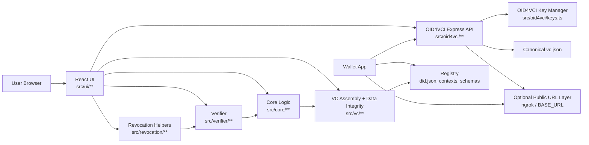
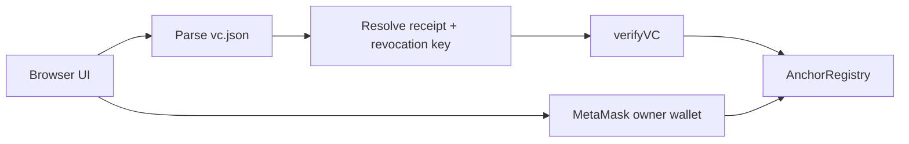

# Issuer Architecture

This document describes the architecture of the issuer repository, with emphasis on the split between the JSON-LD/Data Integrity issuance path, the custom smart-contract verifier path, and the OID4VCI/JWT issuance path used by wallets.

## High-Level View

The repository contains three main flows that share project context but serve different consumers:

- UI issuance path:
  builds batch-oriented Merkle data, deploys a fresh contract per batch, signs a VC JSON-LD document, and lets the user download `vc.json`
- UI verification and revocation path:
  verifies anchored VCs against the smart contract and lets the owner wallet revoke them on-chain
- Wallet pickup path:
  exposes an OID4VCI issuer API that signs a JWT VC with ES256 for wallet import

These flows are related, but they are not the same signing pipeline.

## Runtime Topology



## Architecture Layers

### 1. UI Layer

Location:

- `src/ui/**`

Responsibilities:

- browser-facing issuer screens
- input capture for issuance
- verification and revocation controls
- wallet pickup UI
- QR/deep-link presentation for OID4VCI pickup

Important boundary:

- `src/ui/**` should not own core credential logic
- it delegates issuance work to `src/core/**`, `src/vc/**`, or the OID4VCI API

### 2. Core Credential Logic Layer

Location:

- `src/core/**`

Responsibilities:

- hashing
- Merkle tree construction
- batch orchestration
- contract deployment + one-time anchoring
- anchoring support
- MetaMask transaction helpers for smart-contract interactions
- data preparation shared by issuance behavior

This layer contains domain logic that should remain UI-agnostic.

### 3. Revocation Helper Layer

Location:

- `src/revocation/**`

Responsibilities:

- derive the phase-1 revocation key from a VC or Merkle receipt
- build a revocation request from the credential's embedded receipt

Current rule:

- the smart-contract revocation key is the **first mandatory component hash** in `componentsProofs`

This rule intentionally minimizes scope by reusing the contract's existing `revokeCertificate(bytes32,string)` and `isValid(bytes32)` model.

### 4. VC Assembly And Data Integrity Layer

Location:

- `src/vc/**`

Responsibilities:

- assembling the W3C VC JSON-LD shape
- normalizing registry URLs where needed
- signing VC JSON-LD with Data Integrity proof

Current signing behavior:

- proof type: `DataIntegrityProof`
- cryptosuite: `eddsa-rdfc-2022`
- key source: `ISSUER_ED25519_PRIVATE_KEY`

This path is used for downloadable `vc.json` issuance from the UI.

### 5. Verifier Layer

Location:

- `src/verifier/**`

Responsibilities:

- standard VC checks
- Merkle receipt validation
- chain anchoring verification
- smart-contract revocation verification

Current revocation behavior on `main`:

- after anchoring checks succeed, the verifier calls `isValid(bytes32)` on the same contract
- if the contract reports revoked, the overall VC result becomes `valid = false`
- the verifier surfaces `revoked`, `revocationReason`, and `revocationKey` for operator visibility

This is an IU-specific revocation path. It is not intended as a wallet-interoperable revocation mechanism.

### 6. OID4VCI API Layer

Location:

- `src/oid4vci/**`

Responsibilities:

- expose OID4VCI issuer metadata
- create pre-authorized-code offers
- issue access tokens and nonces
- return wallet-importable credentials as `jwt_vc_json`

Main endpoints:

- `GET /.well-known/openid-credential-issuer`
- `GET /.well-known/jwks.json`
- `GET /oid4vci/credential-offer`
- `GET /oid4vci/pickup-offer`
- `GET|POST /oid4vci/nonce`
- `POST /oid4vci/token`
- `POST /oid4vci/credential`

Current storage model:

- pre-authorized codes, access tokens, and nonces are stored in in-memory `Map`s
- good for demos and local development
- not durable across restarts

### 7. OID4VCI Key Management Layer

Primary file:

- `src/oid4vci/keys.ts`

Responsibilities:

- load the active JWT signing key
- infer the signing algorithm
- expose the signing key, `kid`, and public JWKS
- fail fast when a registry-backed `did:web` issuer lacks the required ES256 JWK

Current OID4VCI signing behavior:

- signing format: compact JWT
- signing algorithm: `ES256`
- server-only key source: `OID4VCI_PRIVATE_JWK`
- required `kid` form:
  `did:web:infra-vc-registry-web-911368042037.asia-east2.run.app:issuers:principle#key-1`

### 8. External Registry Dependency

The issuer depends on a separate registry for public identity and static definitions:

- issuer DID documents, such as `/issuers/principle/did.json`
- public verification keys
- contexts
- schemas

The issuer signs with the private key corresponding to the public key hosted by that registry.

## Dual Signing Paths

This is the most important architectural split in the repository.

| Flow | Entry point | Output | Signing format | Key material |
| --- | --- | --- | --- | --- |
| UI issuance | React UI -> `src/core/**` -> `src/vc/**` | `vc.json` | Data Integrity / Ed25519 | `ISSUER_ED25519_PRIVATE_KEY` |
| UI verify + revoke | React UI -> `src/verifier/**`, `src/revocation/**`, `src/core/chain/**` | verification result + revoke tx | smart-contract reads/writes | MetaMask owner wallet |
| Wallet pickup | Wallet -> `src/oid4vci/**` | JWT VC | JWT / ES256 | `OID4VCI_PRIVATE_JWK` |

Implication:

- fixing wallet import issues usually means looking in `src/oid4vci/**`
- fixing downloaded VC proof issues usually means looking in `src/vc/**`
- fixing custom revocation verification issues usually means looking in `src/verifier/**`, `src/revocation/**`, and `src/core/chain/**`

The two paths intentionally use different signing technologies because they target different consumers.

## Request And Data Flow

### A. UI-issued VC JSON-LD flow


Flow summary:

1. user enters data in the browser
2. core logic computes hashes and Merkle proofs
3. `assembleVc` creates the JSON-LD VC
4. `signVc` adds the Ed25519 Data Integrity proof
5. browser downloads `vc.json`

### B. UI verify and revoke flow



Flow summary:

1. user pastes VC JSON into the verifier tab
2. verifier resolves the Merkle receipt from the VC
3. revocation logic derives the first mandatory component hash
4. verifier checks anchoring and then `isValid(bytes32)` on the contract
5. if the owner wallet submits `revokeCertificate(bytes32,string)`, subsequent verification returns invalid
### C. Wallet pickup OID4VCI flow

```mermaid
flowchart LR
    UI[Wallet Pickup UI]
    Offer[/pickup-offer]
    OfferUri[credential_offer_uri]
    Wallet[Wallet]
    Meta[issuer metadata]
    Token[token endpoint]
    Cred[credential endpoint]
    JWT[ES256 JWT VC]
    DID[Registry did.json]

    UI --> Offer
    Offer --> OfferUri
    OfferUri --> Wallet
    Wallet --> Meta
    Wallet --> Token
    Wallet --> Cred
    Cred --> JWT
    Wallet --> DID
```

Flow summary:

1. UI asks the issuer for a pickup offer
2. wallet follows the offer reference
3. wallet discovers issuer metadata
4. wallet exchanges pre-authorized code for token
5. wallet requests credential
6. issuer signs JWT with ES256
7. wallet resolves `did:web` and verifies the JWT against the registry-hosted public key

## File Ownership By Area

| Area | Main files | Responsibility |
| --- | --- | --- |
| UI | `src/ui/**` | Browser UX, issue/verify/revoke controls, wallet pickup trigger |
| Core logic | `src/core/**` | Hashing, Merkle logic, anchoring and revoke transaction helpers |
| Revocation helpers | `src/revocation/**` | Revocation key derivation and VC request extraction |
| Verifier | `src/verifier/**` | Standard, Merkle, chain, and revocation validation |
| VC generation | `src/vc/assembleVc.ts`, `src/vc/signVc.ts`, `src/vc/types.ts` | JSON-LD VC building and Ed25519 proof generation |
| OID4VCI HTTP surface | `src/oid4vci/oid4vci.routes.ts`, `src/oid4vci/oid4vci.controller.ts` | Endpoint routing and HTTP payloads |
| OID4VCI state + issuance | `src/oid4vci/oid4vci.service.ts` | Codes, tokens, nonces, JWT payload assembly |
| OID4VCI keying | `src/oid4vci/keys.ts`, `src/oid4vci/did.ts` | ES256 key init, JWKS, DID helper behavior |
| Runtime entrypoints | `src/oid4vci/server.ts`, `src/oid4vci/startWithNgrok.ts` | Server boot and optional public tunnel orchestration |

## Configuration Model

## Browser-Injected Env

These are allowlisted through `vite.config.ts` and become available to browser code:

- `BASE_URL`
- `OID4VCI_BASE_URL`
- `ISSUER_DID`
- `DEGREE_CONTEXT_URL`
- `IU_SMARTCERT_CONTEXT_URL`
- `MERKLE_CONTEXT_URL`
- `SCHEMA_URL`
- `CHAIN_ID`
- `RPC_URL`
- `CONTRACT_ADDRESS`
- `ISSUER_ED25519_PRIVATE_KEY`
- `DEV`

Important note:

- browser env is bundled into the client build
- this is acceptable for demo-only flows
- it is not the place for server-only OID4VCI JWT secrets

## Server-Only Env

These are consumed by the OID4VCI server process directly:

- `OID4VCI_PRIVATE_JWK`
- `OID4VCI_PORT`
- `BASE_URL`
- `NGROK_DOMAIN`
- `NGROK_AUTHTOKEN`

Important split:

- `ISSUER_ED25519_PRIVATE_KEY` drives the Data Integrity path
- `OID4VCI_PRIVATE_JWK` drives the wallet OID4VCI JWT path

That split is deliberate and should stay explicit in operations documentation.

## Public URL Resolution

The architecture distinguishes between local and wallet-reachable issuer URLs:

- the UI uses `OID4VCI_BASE_URL`, then `BASE_URL`, then `http://localhost:8787`
- the issuer metadata uses `BASE_URL`
- `oid4vci:tunnel` can derive `BASE_URL` from `NGROK_DOMAIN`

This matters because wallets must resolve issuer metadata and credential endpoints from a URL they can actually reach.

## Architecture Strengths

- clear separation between browser UI and issuer API
- explicit split between Data Integrity and JWT issuance
- registry-backed verification model for wallet import
- small, readable OID4VCI implementation

## Current Limitations

- OID4VCI state is in-memory only
- wallet pickup API and UI are still demo-oriented
- JSON-LD/Data Integrity path and OID4VCI/JWT path are separate, so operators must manage two signing configurations
- `BASE_URL` and `ISSUER_DID` can drift if not configured carefully

## Operational Rule Of Thumb

Use this rule when debugging:

- problem in downloaded `vc.json` proof -> inspect `src/vc/**`
- problem in wallet import / OID4VCI flow -> inspect `src/oid4vci/**`
- problem in wallet signature verification -> compare `OID4VCI_PRIVATE_JWK` against registry `did.json`
