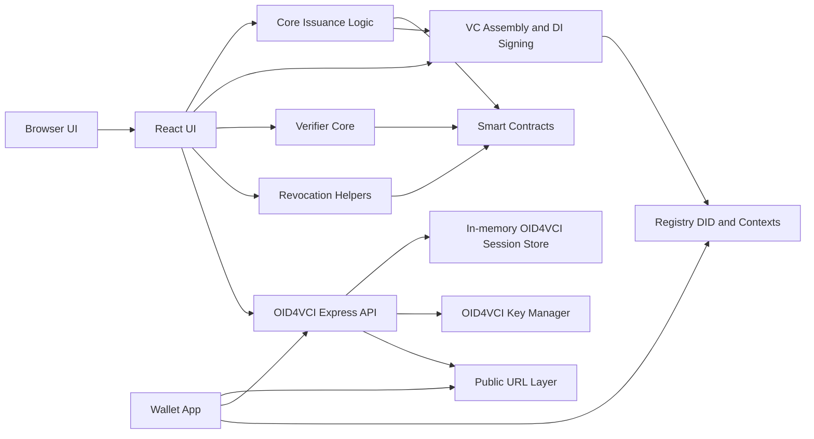
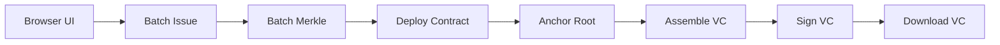
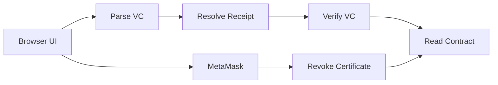
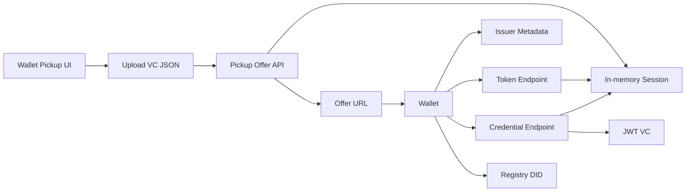

# Issuer Architecture

This document describes the current architecture of the repository as of March 12, 2026. It covers the browser issuance and verification flows, the smart-contract anchoring model, and the OID4VCI wallet-import path.

## High-Level View

The repository currently contains three production-relevant flows:

- UI issuance path:
  builds a small development batch of student components, computes one Merkle root per batch, deploys one fresh contract per batch, anchors the root once, signs JSON-LD VCs, and lets the operator download per-student `vc.json` files
- UI verification and revocation path:
  verifies a VC against receipt data, chain anchoring, and on-chain revocation, and lets the contract owner revoke via MetaMask
- Wallet pickup path:
  accepts an uploaded VC snapshot, creates an OID4VCI credential offer, and later signs a wallet-importable JWT VC from that uploaded snapshot

These flows share credential context, but they do not share one signing pipeline.

## Runtime Topology

## Architecture Layers

### 1. UI Layer

Location:

- `src/ui/**`

Responsibilities:

- browser-facing batch issuance flow
- verification and revocation controls
- wallet pickup upload flow
- QR rendering, offer URL copy, and result display

Important boundary:

- `src/ui/**` should not own credential-domain logic
- it delegates issuance to `src/core/**` and `src/vc/**`
- it delegates wallet protocol behavior to `src/oid4vci/**`

### 2. Core Credential Logic Layer

Location:

- `src/core/**`

Responsibilities:

- component hashing
- batch Merkle construction
- one-contract-per-batch deployment
- one-time root anchoring
- MetaMask-based chain operations

Current issuance rule:

- one issuance batch = one Merkle root = one deployed contract

On `main`, the current issue screen is intentionally a testing-sized batch flow for `1` or more students. One issue action creates a distinct VC for each uploaded `diploma`, `transcript`, or `recruiterSubmission` PDF while sharing one batch Merkle root and contract anchor.

### 3. VC Assembly and Data Integrity Layer

Location:

- `src/vc/**`

Responsibilities:

- assemble W3C VC JSON-LD
- attach Merkle receipt data
- sign with `DataIntegrityProof`

Current signing behavior:

- proof type: `DataIntegrityProof`
- cryptosuite: `eddsa-rdfc-2022`
- key source: `ISSUER_ED25519_PRIVATE_KEY`

This path produces downloadable JSON-LD credentials for the browser issuance flow.

### 4. Verifier Layer

Location:

- `src/verifier/**`

Responsibilities:

- standard VC checks
- Merkle receipt validation
- smart-contract anchoring validation
- on-chain revocation validation

Current verifier outcome:

- after receipt and chain checks succeed, the verifier consults the same contract for revocation state
- if revoked, the overall result becomes invalid

This is an IU-specific verification model, not a general wallet-verifier interoperability protocol.

### 5. Revocation Helper Layer

Location:

- `src/revocation/**`

Responsibilities:

- derive the revocation key from the credential receipt
- build a revocation request for chain operations

Current rule:

- the revocation key is the first mandatory component hash in `componentsProofs`

### 6. OID4VCI API Layer

Location:

- `src/oid4vci/**`

Responsibilities:

- expose issuer metadata and JWKS
- create pre-authorized credential offers
- exchange pre-authorized codes for access tokens
- issue wallet-importable `jwt_vc_json` credentials
- keep transient uploaded VC snapshots tied to the pickup session

Main endpoints:

- `GET /.well-known/openid-credential-issuer`
- `GET /.well-known/openid-credential-issuer-draft11`
- `GET /.well-known/jwks.json`
- `GET /oid4vci/credential-offer`
- `GET /oid4vci/pickup-offer`
- `POST /oid4vci/pickup-offer`
- `GET|POST /oid4vci/nonce`
- `POST /oid4vci/token`
- `POST /oid4vci/credential`

Important current behavior:

- the default metadata endpoint is pure Draft 13
- a separate legacy Draft 11 endpoint is preserved for older wallets
- the main UI uses `POST /oid4vci/pickup-offer` with an uploaded VC JSON payload

### 7. OID4VCI Session and Key Management

Primary files:

- `src/oid4vci/oid4vci.service.ts`
- `src/oid4vci/keys.ts`

Responsibilities:

- store pre-authorized codes, access tokens, nonces, and uploaded VC snapshots in memory
- load the active JWT signing key
- infer signing algorithm
- expose JWKS and signing metadata

Current wallet signing behavior:

- output format: compact JWT VC
- algorithm: `ES256` for registry-backed `did:web` deployments
- server-only key source: `OID4VCI_PRIVATE_JWK`

Important operational property:

- OID4VCI session state is in-memory only
- offer creation and token redemption must hit the same running issuer instance

### 8. External Registry and Chain Dependencies

The repo depends on external systems for public trust and final anchoring:

- registry DID documents
- public verification keys
- contexts and schemas
- blockchain RPC and deployed anchoring contracts

The wallet path relies on registry-hosted public keys. The browser verifier path relies on the credential receipt plus on-chain reads.

## Dual Signing Paths

This is the most important architectural split in the repository.

| Flow | Entry point | Output | Signing format | Key material |
| --- | --- | --- | --- | --- |
| UI issuance | React UI -> `src/core/**` -> `src/vc/**` | JSON-LD `vc.json` | Data Integrity / Ed25519 | `ISSUER_ED25519_PRIVATE_KEY` |
| UI verify + revoke | React UI -> `src/verifier/**`, `src/revocation/**`, `src/core/chain/**` | verification result + revoke tx | smart-contract reads/writes | MetaMask owner wallet |
| Wallet pickup | Wallet -> `src/oid4vci/**` | JWT VC from uploaded snapshot | JWT / ES256 | `OID4VCI_PRIVATE_JWK` |

Implication:

- wallet import bugs usually live in `src/oid4vci/**`
- downloaded VC proof bugs usually live in `src/vc/**`
- receipt / chain / revocation bugs usually live in `src/verifier/**`, `src/revocation/**`, and `src/core/chain/**`

## Request and Data Flows

### A. UI-issued JSON-LD credential flow

Summary:

1. operator enters a small development batch
2. batch logic computes hashes and one Merkle root
3. chain logic deploys a fresh contract and anchors the root once
4. VC assembly creates per-student credentials referencing the same batch anchor
5. browser downloads one signed VC per student

### B. UI verify and revoke flow

Summary:

1. user pastes or loads VC JSON into the verifier tab
2. verifier resolves receipt data from the credential
3. verifier checks standard validity, Merkle proofs, anchoring, and revocation
4. if needed, the owner wallet sends a revoke transaction to the same contract

### C. Wallet pickup OID4VCI flow

Summary:

1. UI uploads a VC JSON snapshot to the issuer
2. issuer creates a transient pre-authorized offer linked to that uploaded snapshot
3. wallet resolves the offer and issuer metadata
4. wallet exchanges the pre-authorized code for a token
5. credential endpoint signs a JWT VC from the uploaded snapshot
6. wallet verifies the JWT against the registry DID key

## File Ownership by Area

| Area | Main files | Responsibility |
| --- | --- | --- |
| UI | `src/ui/**` | browser issuance, verification, revocation, wallet pickup |
| Core issuance | `src/core/**` | hashing, Merkle logic, batch deployment, anchoring |
| Revocation helpers | `src/revocation/**` | revocation key derivation and request extraction |
| Verifier | `src/verifier/**` | standard, receipt, chain, and revocation validation |
| VC generation | `src/vc/**` | JSON-LD VC assembly and Data Integrity signing |
| OID4VCI HTTP surface | `src/oid4vci/oid4vci.routes.ts`, `src/oid4vci/oid4vci.controller.ts` | endpoint routing and HTTP payloads |
| OID4VCI state + issuance | `src/oid4vci/oid4vci.service.ts` | codes, tokens, uploaded VC snapshots, JWT payload assembly |
| OID4VCI keying | `src/oid4vci/keys.ts`, `src/oid4vci/did.ts` | signing key init, JWKS, DID helper behavior |
| Runtime entrypoints | `src/oid4vci/server.ts`, `src/oid4vci/startWithNgrok.ts` | server boot and optional public URL exposure |

## Configuration Model

### Browser-Injected Env

These are allowlisted through `vite.config.ts` and become available to browser code:

- `BASE_URL`
- `OID4VCI_BASE_URL`
- `ISSUER_DID`
- `DEGREE_CONTEXT_URL`
- `IU_SMARTCERT_CONTEXT_URL`
- `MERKLE_CONTEXT_URL`
- `SCHEMA_URL`
- `CHAIN_ID`
- `RPC_URL`
- `ISSUER_ED25519_PRIVATE_KEY`
- `DEV`

Important note:

- browser env is bundled into the client build
- this is acceptable for demo flows
- it must not contain server-only JWT signing secrets

### Server-Only Env

These are consumed by the OID4VCI server process directly:

- `OID4VCI_PRIVATE_JWK`
- `OID4VCI_PORT`
- `BASE_URL`
- `NGROK_DOMAIN`
- `NGROK_AUTHTOKEN`

Important split:

- `ISSUER_ED25519_PRIVATE_KEY` drives the JSON-LD Data Integrity path
- `OID4VCI_PRIVATE_JWK` drives the wallet JWT issuance path

## Public URL Resolution

The architecture distinguishes between browser-callable and wallet-reachable URLs:

- browser pickup code resolves issuer base URL from `OID4VCI_BASE_URL`, then `BASE_URL`, then `http://localhost:8787`
- issuer metadata and offer references are built from server-side `BASE_URL`
- `oid4vci:tunnel` can derive `BASE_URL` from `NGROK_DOMAIN`

Operational rule:

- the same public issuer instance must both create and redeem the pre-authorized code
- mismatched instances or restarts break `/oid4vci/token` because session state is in memory

## Architecture Strengths

- clear separation between browser UI, issuance core, verifier core, and OID4VCI API
- explicit one-batch-one-contract anchoring model
- explicit split between Data Integrity signing and JWT signing
- small and readable OID4VCI implementation
- upload-based wallet pickup removes the unstable global `vc.json` dependency

## Current Limitations

- OID4VCI state is in-memory only
- wallet pickup is single-instance friendly, not horizontally persistent
- JSON-LD issuance and JWT wallet issuance use different signing stacks and keys
- custom IU revocation and anchoring checks are not a standard wallet-status mechanism
- the current issue UI is a development-sized batch operator flow, not a production bulk console

## Operational Rule of Thumb

Use this rule when debugging:

- problem in downloaded JSON-LD VC proof -> inspect `src/vc/**`
- problem in wallet import / metadata / token / JWT path -> inspect `src/oid4vci/**`
- problem in receipt / anchoring / revocation result -> inspect `src/verifier/**`, `src/revocation/**`, and `src/core/chain/**`
