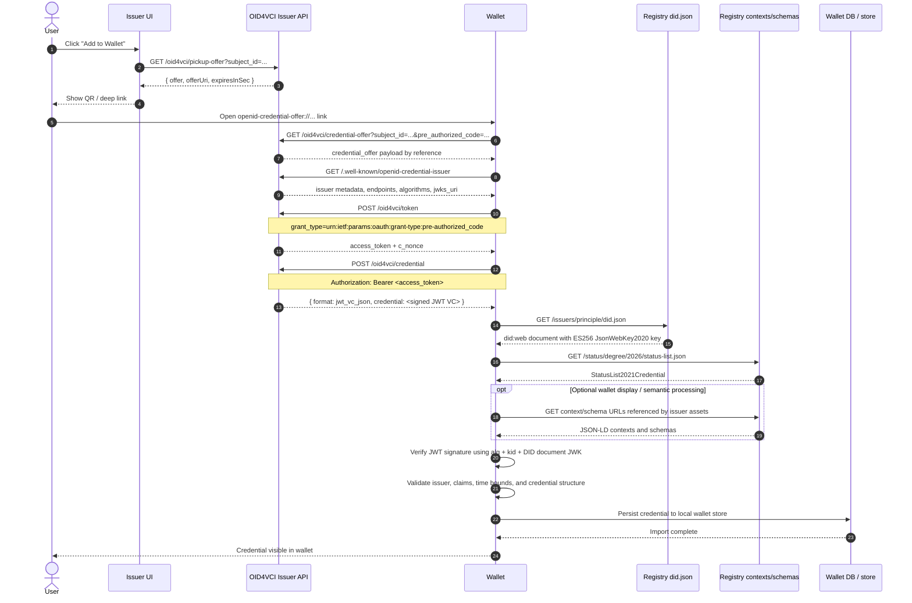

# Wallet Verification And Import Flow

This document explains the wallet-facing OID4VCI flow in this repository, from the user clicking wallet pickup in the UI to the wallet verifying the issued JWT VC and importing it into its local credential store.

## Scope

This document covers:

- the UI call that starts wallet pickup
- the OID4VCI calls from wallet to issuer
- the registry calls used for issuer key verification
- the status-list lookup used for wallet-facing revocation
- the point at which the wallet can safely import the credential into its local DB/store

This document does not describe proprietary Sphereon wallet internals. The final DB import step is described from standard wallet behavior: verify first, persist second.

## Main Actors

| Actor | Role in the flow |
| --- | --- |
| User | Starts the pickup flow from the issuer UI and approves import in the wallet |
| Issuer UI | Calls the local pickup API and presents QR/deep-link data |
| Wallet | Resolves issuer metadata, requests token and credential, verifies signature, imports credential |
| OID4VCI Issuer API | Exposes metadata, offer, token, nonce, and credential endpoints |
| Registry DID endpoint | Serves the issuer `did:web` document and public verification key |
| Status list endpoint | Serves the issuer `StatusList2021Credential` used for revocation lookup |
| Registry context/schema endpoints | May serve referenced JSON-LD contexts or schemas for downstream display/validation flows |
| Wallet DB / secure store | Stores the credential after verification succeeds |

## End-To-End Sequence



## Detailed Flow By Step

### 1. User starts wallet pickup

The React UI calls the issuer pickup endpoint:

- Endpoint: `GET /oid4vci/pickup-offer`
- Code path: `src/ui/pickupApi.ts` -> `src/oid4vci/oid4vci.controller.ts#getPickupOffer`

The issuer returns:

- `offer`: the raw credential offer payload
- `offerUri`: an `openid-credential-offer://` URI containing a `credential_offer_uri`
- `expiresInSec`: TTL for the generated pre-authorized code

The UI shows that `offerUri` as a QR code or deep link.

### 2. Wallet opens the offer by reference

The wallet opens the deep link and resolves the referenced offer URL:

- Endpoint: `GET /oid4vci/credential-offer`

The issuer returns a payload that includes:

- `credential_issuer`: base URL of the issuer API
- `credential_configuration_ids`: currently `IU_Degree_JWTVC`
- pre-authorized code grant details

At this point the wallet knows which issuer it is dealing with and which credential configuration to request.

### 3. Wallet resolves issuer metadata

The wallet calls:

- Endpoint: `GET /.well-known/openid-credential-issuer`

The issuer returns metadata including:

- `credential_endpoint`
- `token_endpoint`
- `nonce_endpoint`
- `jwks_uri`
- `credential_configurations_supported`
- `credential_signing_alg_values_supported`

In the current working registry-backed configuration, the important values are:

- format: `jwt_vc_json`
- binding methods: includes `did:web`
- signing algorithm: `ES256`

This step tells the wallet which protocol endpoints and signing algorithm to expect.

### 4. Wallet exchanges the pre-authorized code for an access token

The wallet calls:

- Endpoint: `POST /oid4vci/token`

The issuer validates the pre-authorized code from its in-memory store and returns:

- `access_token`
- `token_type`
- `expires_in`
- `c_nonce`
- `c_nonce_expires_in`

Current implementation detail:

- pre-authorized codes, access tokens, and nonces are stored in memory inside `src/oid4vci/oid4vci.service.ts`
- this means the current OID4VCI issuer is demo-friendly but not horizontally persistent

### 5. Wallet requests the credential

The wallet calls:

- Endpoint: `POST /oid4vci/credential`
- Header: `Authorization: Bearer <access_token>`

The issuer:

1. validates the access token
2. loads the canonical `vc.json`
3. maps it into a JWT VC payload
4. signs it with the active OID4VCI key

Current signing behavior:

- algorithm: `ES256`
- JWT header `kid`: `did:web:infra-vc-registry-web-911368042037.asia-east2.run.app:issuers:principle#key-1`
- signing key source: `OID4VCI_PRIVATE_JWK`

The response shape is:

```json
{
  "format": "jwt_vc_json",
  "credential": "<compact-jwt>"
}
```

The wallet-facing credential now also carries `vc.credentialStatus` pointing to the canonical registry status list URL.

### 6. Wallet resolves the issuer public key from the registry

The wallet reads:

- JWT header `alg`
- JWT header `kid`
- JWT payload `iss`

Because the issuer is a `did:web`, the wallet resolves the issuer DID through the registry:

- DID: `did:web:infra-vc-registry-web-911368042037.asia-east2.run.app:issuers:principle`
- DID document path: `/issuers/principle/did.json`

The registry returns a DID document containing:

- `verificationMethod`
- `assertionMethod`
- `publicKeyJwk`
- `alg: ES256`
- `kid: did:web:...#key-1`

This is the public key material the wallet uses to verify the JWT signature.

### 7. Wallet resolves revocation status

When the credential includes:

- `credentialStatus.type = StatusList2021Entry`
- `credentialStatus.statusListCredential = <registry status list URL>`
- `credentialStatus.statusListIndex = <bit index>`

the wallet can fetch the issuer status list and inspect the indicated bit to determine whether the credential is revoked.

Important distinction:

- `valid` / `never expired` style labels come from temporal validity such as `validFrom` and `validUntil`
- revocation comes from `credentialStatus` and the registry status list document

### 8. Wallet verifies before import

The wallet should only import the credential after these checks succeed:

1. The JWT signature verifies under the DID document public key.
2. The JWT `kid` matches the DID document verification method.
3. The algorithm is acceptable, currently `ES256`.
4. The issuer in the credential matches the expected issuer identity.
5. Time-based claims such as `iat` and `nbf` are acceptable.
6. If `credentialStatus` is present, the referenced status list does not mark the credential revoked.
7. The wallet accepts the credential format and claim structure.

If any of those checks fail, the credential should be rejected before persistence.

### 9. Wallet imports the credential into local storage

After successful verification, the wallet can store the credential in its local DB / secure credential store.

This repository does not implement wallet storage, but operationally the import boundary is:

`verify successfully -> accept credential -> write to wallet store`

That is the point at which the credential becomes visible to the end user in the wallet UI.

## Who Does What

| Component | What it does | What it does not do |
| --- | --- | --- |
| Issuer UI | Starts pickup, requests offer URI, renders QR/deep link | Does not mint tokens, sign JWTs, or verify wallet imports |
| OID4VCI Issuer API | Hosts OID4VCI endpoints, issues tokens, signs JWT VC | Does not control wallet verification rules or wallet DB persistence |
| Registry | Publishes issuer DID document and public verification key | Does not issue the credential itself |
| Wallet | Executes OID4VCI protocol, resolves DID, verifies signature, decides import | Does not trust the issuer response blindly |
| Wallet DB | Stores accepted credentials after verification | Does not perform protocol calls itself |

## Failure Matrix

| Failure point | Typical cause | Observed symptom |
| --- | --- | --- |
| Pickup offer generation | Wrong `OID4VCI_BASE_URL` or issuer unreachable | QR/deep link cannot be created |
| Credential offer resolution | Expired pre-authorized code | Wallet cannot continue pickup |
| Issuer metadata lookup | Wrong `BASE_URL`, public URL unreachable, tunnel misconfigured | Wallet cannot discover token/credential endpoints |
| Token exchange | Missing or invalid pre-authorized code | `invalid_grant` from `/oid4vci/token` |
| Credential issuance | Missing or invalid bearer token | `invalid_token` from `/oid4vci/credential` |
| Signature verification | `OID4VCI_PRIVATE_JWK` does not match registry `did.json` public key | Wallet shows `invalid_signature` |
| DID resolution | Registry `did.json` unreachable or wrong path | Wallet cannot verify issuer key |
| `kid` alignment | JWT header `kid` differs from DID document verification method | Wallet rejects credential before import |
| Algorithm alignment | Metadata/JWT/DID document disagree on `ES256` vs `EdDSA` | Wallet rejects key or signature |
| Wallet import | Wallet-specific schema or trust policy rejection | Credential not written to wallet store |

## Current Repository Mapping

| Flow stage | Primary file |
| --- | --- |
| UI pickup call | `src/ui/pickupApi.ts` |
| Offer URI creation | `src/oid4vci/offerUri.ts` |
| OID4VCI routes | `src/oid4vci/oid4vci.routes.ts` |
| Endpoint handlers | `src/oid4vci/oid4vci.controller.ts` |
| Token / nonce / JWT service logic | `src/oid4vci/oid4vci.service.ts` |
| Key initialization and JWKS | `src/oid4vci/keys.ts` |
| DID helper utilities | `src/oid4vci/did.ts` |

## Practical Verification Checklist

When debugging a wallet import failure, verify these in order:

1. `/.well-known/openid-credential-issuer` is reachable from the wallet device.
2. `credential_signing_alg_values_supported` contains `ES256`.
3. The issued JWT header uses the expected `kid`.
4. The registry `did.json` uses the same `kid`, `x`, and `y`.
5. The issuer actually started with the intended `OID4VCI_PRIVATE_JWK`.
6. The pre-authorized code and access token are still within TTL.

If all six are true, the wallet has what it needs to verify and import successfully.
